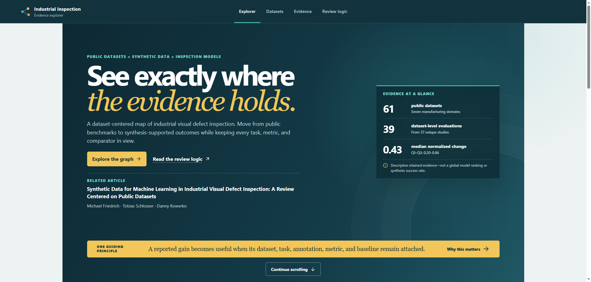

# Manufacturing Visual Inspection Evidence Repository

This repository accompanies **Synthetic Data for Machine Learning in Industrial Visual Defect Inspection: A Review Centered on Public Datasets**. Its static, interactive website connects public manufacturing datasets with synthesis-supported evaluations and the related literature, keeping tasks, annotations, models, metrics, and comparator conditions in view.

**Authors:** [Michael Friedrich](https://orcid.org/0000-0001-6326-4749), [Tobias Schlosser](https://orcid.org/0000-0002-0682-4284), and [Danny Kowerko](https://orcid.org/0000-0002-4538-7814).

**[Open the Industrial Inspection Evidence Explorer](https://fmicha92.github.io/industrial-defect-inspection-review/)**




## Evidence at a glance

| Measure | Current website |
|---|---:|
| Public dataset registry records | 61 |
| Manufacturing-domain groups | 7 |
| Non-exclusive dataset–task assignments | 92 |
| Retained dataset-level synthesis evaluations | 39 |
| Unique publications supporting those evaluations | 37 |
| Graph notes | 896 |
| Resolved directed wikilinks | 8,926 |

Graph counts refer to the repository snapshot dated 27 August 2026. The graph covers a broader literature scope than the curated registry and retained evaluations; a graph record does not imply review inclusion. Multiple task assignments may apply to one dataset.


## Explore the website

- Explore the full evidence graph or a local neighborhood, search titles and aliases, inspect connected records, pin nodes, and trace directed wikilink paths.
- [Browse the 61-dataset registry](https://fmicha92.github.io/industrial-defect-inspection-review/datasets/), filter by domain and task, compare datasets, and inspect coverage and citation trends.
- [Inspect all 39 synthesis evaluations](https://fmicha92.github.io/industrial-defect-inspection-review/evidence/), including the normalized-change distribution, and open individual results with their study and comparator context.
- [Read the review logic and interpretation guidance](https://fmicha92.github.io/industrial-defect-inspection-review/review/), including the research questions, evaluation framework, limitations, and reference downloads.
- Share links to filtered views and selected graph records, or download the public JSON bundles and CSV reference tables.


## About the manuscript

The manuscript presents a dataset-centered review of synthetic-data support for machine learning in industrial visual defect inspection. It connects **61 public datasets across seven manufacturing-domain groups** with **39 dataset-level evaluations from 37 unique publications**.

The review addresses three questions:

1. Which public manufacturing image datasets support reproducible defect-inspection evaluation?
2. Which synthesis methods show downstream benefits under documented dataset, task, annotation, metric, and baseline conditions?
3. Which inspection models and pipelines are promising under those same conditions?

The repository supports this work through a linked Markdown evidence graph, machine-readable exports, review resources, project-specific processing tools, and an interactive companion website. Reported outcomes must be interpreted within their experimental conditions; the retained comparisons do not establish a universal success rate or a global ranking of synthesis methods or inspection models.


## Repository resources

- **Inspect the underlying records:** [evidence guide](evidence/README.md), [Markdown graph](evidence/graph/), and [CSV/JSON exports](evidence/graph/exports/).
- **Understand the review process:** [protocol, screening, and extraction resources](evidence/review/README.md).
- **Run the software:** [toolkit guide](tools/README.md), [website guide](website/README.md), and [reproducibility instructions](docs/REPRODUCIBILITY.md).


## Repository organization

| Directory | Contents |
|---|---|
| [evidence/](evidence/) | Graph notes, schemas, exports, review protocol, decision templates, and publication-material guidance |
| [tools/](tools/) | Python toolkit, command-line helpers, tests, configuration, project skills, and attributed third-party skills |
| [docs/](docs/) | Repository map, data dictionary, provenance, quality, release guidance, and license texts |
| [website/](website/) | Interactive website source, checked-in scientific assets, and reference downloads |

Repository-level files provide the Python package definition, Make commands, environment specification, citation metadata, and contribution and licensing policies. Continuous-integration and Pages workflows are in [.github/workflows/](.github/workflows/). See the [repository map](docs/REPOSITORY_MAP.md) for the complete layout and naming conventions.


## Verify the evidence toolkit

Python 3.10 or newer is sufficient. The core checks run offline with the standard library and do not rewrite evidence or exports.

With GNU Make and a POSIX shell:

```bash
make check
```

With PowerShell:

```powershell
$env:PYTHONPATH = "tools/src"
python -m inspection_evidence.cli validate
python -m inspection_evidence.cli export --check
python -m unittest discover -s tools/tests -v
```

The standalone wrappers also work without package installation:

```bash
python tools/validate_repository.py
python tools/export_knowledge_graph.py --check
```

Use `make export` only when intentionally regenerating exports from the vault. Installation and direct-command alternatives are documented in the [reproducibility guide](docs/REPRODUCIBILITY.md).


## Run the website

With Node.js 22 and pnpm 11.19.0, run from the repository root:

```bash
cd website
pnpm install --frozen-lockfile
pnpm dev
```

The site uses the committed files in `website/public/data/` and `website/public/downloads/`; no manuscript processing or new evaluation is required. Run `pnpm lint`, `pnpm typecheck`, `pnpm test`, and `pnpm build`, then `pnpm check:pages` to verify the generated routes and assets. Run `pnpm preview` to inspect the production build locally at the `/industrial-defect-inspection-review/` path.

For GitHub Pages, select **GitHub Actions** as the Pages source. The [Pages workflow](.github/workflows/website-pages.yml) builds `website/` and publishes `website/dist/`. See the [website guide](website/README.md) for deployment details.


## Evidence and source-material boundaries

The graph is a literature-navigation resource with a broader scope than the manuscript's dataset registry and retained evaluations. Manufacturing-dataset and synthesis-impact candidate exports are automated pre-screens, not inclusion decisions. Inclusion requires manual confirmation of an eligible public manufacturing dataset, explicit synthesis support, and a downstream inspection outcome with an interpretable comparator.

The website presents existing results; it is not a model leaderboard or a new evaluation. Publication directories contain guidance, not a compilable manuscript. The repository does not distribute paper PDFs, extracted full text, dataset archives, credentials, or private source data. See the [local-workspace policy](docs/LOCAL_WORKSPACE.md).


## Citation and licensing

The manuscript title and authors are listed above. [CITATION.cff](CITATION.cff) describes the repository dataset; its version and release date are not manuscript publication metadata. Confirm contributor and archival identifiers before citing a repository release, and use verified publication metadata when citing the published article.

Project code and project-specific skills are MIT licensed. Original documentation, schemas, exports, and knowledge-graph annotations are licensed under CC BY 4.0. Source-paper material, external dataset metadata, and third-party components retain their original rights. See [LICENSE](LICENSE), [license texts](docs/licenses/), and [THIRD_PARTY_NOTICES.md](THIRD_PARTY_NOTICES.md) before redistribution.

